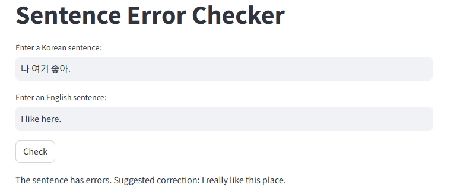

# 한영 번역 오류 검출기
"도착하면 연락해." 라는 문장을 예시로 들어보자. "Call me if you arrive."와 "Call me when you arrive."는 모두 문법적으로 오류가 없는 문장이다. 그러나 "Call me if you arrive"는 살아남는다면 알려달라는 의미로 해석되어 원래 문장과 전혀 다른 의미가 된다. 따라서, 단순 번역만이 아니라 한국어와 영어 문장을 각각 입력하면 두 문장이 같은 의미인지 확인하고, 다른 의미로 보인다면 수정된 문장을 제안해 주는 모델을 만들었다.

## 의미 동일성 검사 모델
사용 데이터
- 의미가 동일한 데이터 : AI hub의 한국어-영어 번역 말뭉치 데이터셋의 뉴스, 한국문화, 구어체, 대화체 중 400개 문장쌍
- 의미가 다르거나 문법 오류가 있는 데이터 : 미국 영화 번역 대본 등을 참고해 200개 문장쌍 직접 생성

사용 모델 : [bert-base-multilingual](https://huggingface.co/google-bert/bert-base-multilingual-cased)

## 한영 번역 모델
사용 데이터 : AI hub의 한국어-영어 번역 말뭉치 데이터셋의 뉴스, 한국문화, 구어체, 대화체 중 50,000개 문장쌍

사용 모델 : [bart-base](https://huggingface.co/facebook/bart-base)

## UI
Streamlit을 사용해 구현

